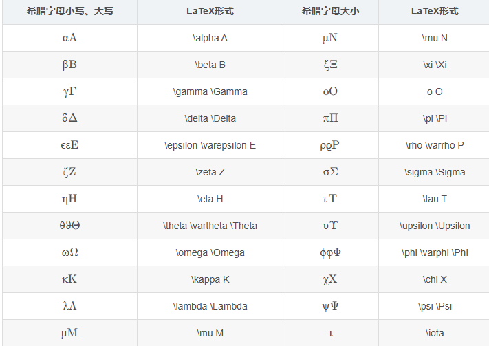

希腊字母小写、大写	LaTeX形式	希腊字母大小	LaTeX形式
αA\alpha AαA	\alpha A	μN\mu NμN	\mu N
βB\beta BβB	\beta B	ξΞ\xi \XiξΞ	\xi \Xi
γΓ\gamma \GammaγΓ	\gamma \Gamma	oOo OoO	o O
δΔ\delta \DeltaδΔ	\delta \Delta	πΠ\pi \PiπΠ	\pi \Pi
ϵεE\epsilon \varepsilon EϵεE	\epsilon \varepsilon E	ρϱP\rho \varrho PρϱP	\rho \varrho P
ζZ\zeta ZζZ	\zeta Z	σΣ\sigma \SigmaσΣ	\sigma \Sigma
ηH\eta HηH	\eta H	τT\tau TτT	\tau T
θϑΘ\theta \vartheta \ThetaθϑΘ	\theta \vartheta \Theta	υΥ\upsilon \UpsilonυΥ	\upsilon \Upsilon
ωΩ\omega \OmegaωΩ	\omega \Omega	ϕφΦ\phi \varphi \PhiϕφΦ	\phi \varphi \Phi
κK\kappa KκK	\kappa K	χX\chi XχX	\chi X
λΛ\lambda \LambdaλΛ	\lambda \Lambda	ψΨ\psi \PsiψΨ	\psi \Psi
μM\mu MμM	\mu M	ι\iotaι	\iota

https://blog.csdn.net/weixin_45152202/article/details/111873526

